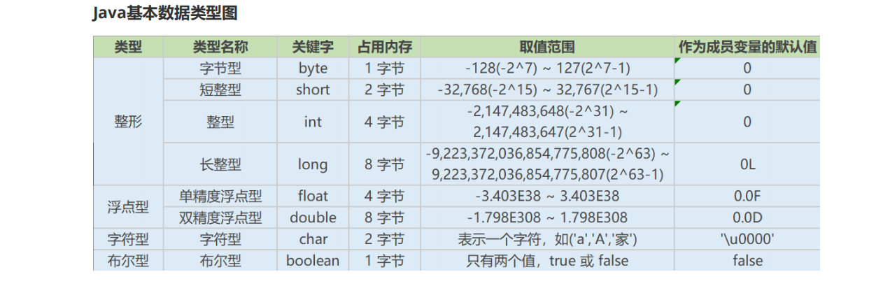

## Java基础

### Java概述

#### 什么是编程？

编程就是让计算机为解决某个问题而使用某种程序设计语言编写程序代码，并最终得到结果的过程。为了使计算机能够理解人的意图，人类就必须要将需解决的问题的思路、方法、和手段通过计算机能够理解的形式告诉计算机，使得计算机能够根据人的指令一步一步去工作，完成某种特定的任务。这种人和计算机之间交流的过程就是编程。

####  什么是Java？

Java是一门面向对象编程语言，不仅吸收了C++语言的各种优点，还摒弃了C++里难以理解的多继承、指针等概念，因此Java语言具有功能强大和简单易用两个特征。Java语言作为静态面向对象编程语言的代表，极好地实现了面向对象理论，允许程序员以优雅的思维方式进行复杂的编程 。

#### JVM、JDK和JRE三者之间的关系

- **JVM**

  > Java Virtual Machine是Java虚拟机，Java程序需要运行在虚拟机上，不同的平台有自己的虚拟机，因此Java语言可以实现跨平台。

- **JDK**

  > Java Development Kit是提供给Java开发人员使用的，其中包含了Java的开发工具，也包括了JRE。所以安装了JDK，就无需再单独安装JRE了。其中的开发工具：编译工具(javac.exe)，打包工具(jar.exe)等

- **JRE**

  > Java Runtime Environment包括Java虚拟机和Java程序所需的核心类库等。核心类库主要是java.lang包：包含了运行Java程序必不可少的系统类，如基本数据类型、基本数学函数、字符串处理、线程、异常处理类等，系统缺省加载这个包

#### 什么是跨平台性？ 原理是什么？

所谓跨平台性，是指java语言编写的程序，一次编译后，可以在多个系统平台上运行。

实现原理：Java程序是通过java虚拟机在系统平台上运行的，只要该系统可以安装相应的java虚拟机，该系统就可以运行java程序。

#### Java语言有哪些特点？

1. 简单易学（Java语言的语法与C语言和C++语言很接近）
2. 面向对象（封装，继承，多态）
3. 平台无关性（Java虚拟机实现平台无关性）
4. 支持网络编程并且很方便（Java语言诞生本身就是为简化网络编程设计的）
5. 支持多线程（多线程机制使应用程序在同一时间并行执行多项任）
6. 健壮性（Java语言的强类型机制、异常处理、垃圾的自动收集等）
7. 安全性

#### 什么是字节码？采用字节码的最大的好处是什么？

**字节码**：

Java源代码经过虚拟机编译器编译后产生的文件（即扩展为.class的文件），它不面向任何特定的处理器，只面向虚拟机。

**好处**：

Java语言通过字节码的方式，在一定程度上解决了传统解释型语言执行效率低的问题，同时又保留了解释型语言可移植的特点。所以Java程序运行时比较高效，而且，由于字节码并不专对一种特定的机器，因此，Java程序无须重新编译便可在多种不同的计算机上运行。

**看下java中的编译器和解释器：**

Java中引入了虚拟机的概念，即在机器和编译程序之间加入了一层抽象的虚拟机器。

这台虚拟的机器在任何平台上都提供给编译程序一个的共同的接口。编译程序只需要面向虚拟机，生成虚拟机能够理解的代码，然后由解释器来将虚拟机代码转换为特定系统的机器码执行。

在Java中，这种供虚拟机理解的码叫做字节码（即扩展为.class的文件），它不面向任何特定的处理器，只面向虚拟机。每一种平台的解释器是不同的，但是实现的虚拟机是相同的。

Java源程序经过编译器编译后变成字节码，字节码由虚拟机解释执行，虚拟机将每一条要执行的字节码送给解释器，解释器将其翻译成特定机器上的机器码，然后在特定的机器上运行，这就是上面提到的Java的特点的编译与解释并存的解释。

Java代码执行过程

> Java源代码  ---->编译器  ---->jvm可执行的Java字节码(即虚拟指令)----> jvm ---->jvm中解释器 ----- >机器可执行的二进制机器码  ---->程序运行。

#### Oracle JDK 和 OpenJDK 的对比

1. Oracle JDK版本将每三年发布一次，而OpenJDK版本每三个月发布一次；

2. OpenJDK 是一个参考模型并且是完全开源的，而Oracle JDK是OpenJDK的一个实现，并不是完全开源的；

3. Oracle JDK 比 OpenJDK 更稳定。OpenJDK和Oracle JDK的代码几乎相同，但Oracle JDK有更多的类和一些错误修复。因此，如果您想开发企业/商业软件，我建议您选择Oracle JDK，因为它经过了彻底的测试和稳定。某些情况下，有些人提到在使用OpenJDK 可能会遇到了许多应用程序崩溃的问题，但是，只需切换到Oracle JDK就可以解决问题；

4. 在响应性和JVM性能方面，Oracle JDK与OpenJDK相比提供了更好的性能；

5. Oracle JDK不会为即将发布的版本提供长期支持，用户每次都必须通过更新到最新版本获得支持来获取最新版本；

6. Oracle JDK根据二进制代码许可协议获得许可，而OpenJDK根据GPL v2许可获得许可。

### 面向对象

#### 什么是面向对象？

面向对象程序设计是以建立模型体现出来的抽象思维过程和面向对象的方法。我们可以将某个事物抽象出来，赋予它自己的特征，并且可以针对这个事物进行相应的操作，以及规定与其他对象之间的关系。可以降低代码的耦合度，使程序更加灵活。

#### 多态的好处？

允许不同类对象对同一消息做出响应，即同一消息可以根据发送对象的不同而采用多种不同的行为方式(发送消息就是函数调用)。即父类型的引用指向子类型的对象。主要有以下优点：

1. 可替换性：多态对已存在代码具有可替换性

2. 可扩充性：增加新的子类不影响已经存在的类结构

3. 更加灵活

#### 面向对象和面向过程的区别？

**面向过程：**

优点：性能比面向对象高，因为类调用时需要实例化，开销比较大，比较消耗资源;比如单片机、嵌入式开发、Linux/Unix等一般采用面向过程开发，性能是最重要的因素。

缺点：没有面向对象易维护、易复用、易扩展

**面向对象：**

优点：易维护、易复用、易扩展，由于面向对象有封装、继承、多态性的特性，可以设计出低耦合的系统，使系统更加灵活、更加易于维护。

缺点：性能比面向过程低

总结：

1. 面向过程是具体化的，流程化的，解决一个问题，你需要一步一步的分析，一步一步的实现。

2. 面向对象是模型化的，你只需抽象出一个类，这是一个封闭的盒子，在这里你拥有数据也拥有解决问题的方法。需要什么功能直接使用就可以了，不必去一步一步的实现，至于这个功能是如何实现的，管我们什么事？我们会用就可以了。

3. 面向对象的底层其实还是面向过程，把面向过程抽象成类，然后封装，方便我们使用的就是面向对象了。

#### 面向对象的三大特性？

其中Java 面向对象编程三大特性：封装 继承 多态

- **封装**

  > 封装把一个对象的属性私有化，同时提供一些可以被外界访问的属性的方法，如果属性不想被外界访问，我们大可不必提供方法给外界访问。但是如果一个类没有提供给外界访问的方法，那么这个类也没有什么意义了。
  >
  > 封装隐藏对象的属性和实现细节，仅对外提供公共访问方式，将变化隔离，便于使用，提高复用性和安全性。

- **继承**

  > 继承是使用已存在的类的定义作为基础建立新类的技术，新类的定义可以增加新的数据或新的功能，也可以用父类的功能，但不能选择性地继承父类。通过使用继承我们能够非常方便地复用以前的代码。
  >
  > 关于继承如下 3 点请记住：
  >
  > 1. 子类拥有父类非 private 的属性和方法。
  >
  > 2. 子类可以拥有自己属性和方法，即子类可以对父类进行扩展。
  >
  > 3. 子类可以用自己的方式实现父类的方法。

- **多态**

  > 所谓多态就是指程序中定义的引用变量所指向的具体类型和通过该引用变量发出的方法调用在编程时并不确定，而是在程序运行期间才确定，即一个引用变量到底会指向哪个类的实例对象，该引用变量发出的方法调用到底是哪个类中实现的方法，必须在由程序运行期间才能决定。
  >
  > 
  >
  > 在Java中有两种形式可以实现多态：继承（多个子类对同一方法的重写）和接口（实现接口并覆盖接口中同一方法）。
  >
  > 
  >
  > 在Java中有两种形式可以实现多态：继承（多个子类对同一方法的重写）和接口（实现接口并覆盖接口中同一方法）。
  >
  > 
  >
  > 方法重载（overload）实现的是编译时的多态性（也称为前绑定），而方法重写（override）实现的是运行时的多态性（也称为后绑定）。

####  什么是多态？Java语言是如何实现多态的？

所谓多态就是指程序中定义的引用变量所指向的具体类型和通过该引用变量发出的方法调用在编程时并不确定，而是在程序运行期间才确定，即一个引用变量倒底会指向哪个类的实例对象，该引用变量发出的方法调用到底是哪个类中实现的方法，必须在由程序运行期间才能决定。

因为在程序运行时才确定具体的类，这样，不用修改源程序代码，就可以让引用变量绑定到各种不同的类实现上，从而导致该引用调用的具体方法随之改变，即不修改程序代码就可以改变程序运行时所绑定的具体代码，让程序可以选择多个运行状态，这就是多态性。

Java实现多态有三个必要条件：继承、重写、向上转型。

- 继承：在多态中必须存在有继承关系的子类和父类。

- 重写：子类对父类中某些方法进行重新定义，在调用这些方法时就会调用子类的方法。

- 向上转型：在多态中需要将子类的引用赋给父类对象，只有这样该引用才能够具备技能调用父类的方法和子类的方法。

  

只有满足了上述三个条件，我们才能够在同一个继承结构中使用统一的逻辑实现代码处理不同的对象，从而达到执行不同的行为。

对于Java而言，它多态的实现机制遵循一个原则：当超类对象引用变量引用子类对象时，被引用对象的类型而不是引用变量的类型决定了调用谁的成员方法，但是这个被调用的方法必须是在超类中定义过的，也就是说被子类覆盖的方法。

#### 面向对象五大原则是什么？

- 单一职责原则SRP(Single Responsibility Principle)

  类的功能要单一，不能包罗万象，跟杂货铺似的。

- 开放封闭原则OCP(Open－Close Principle)

  一个模块对于拓展是开放的，对于修改是封闭的，想要增加功能热烈欢迎，想要修改，哼，一万个

  不乐意。

- 里式替换原则LSP(the Liskov Substitution Principle LSP)

  子类可以替换父类出现在父类能够出现的任何地方。比如你能代表你爸去你姥姥家干活。哈哈~~

- 依赖倒置原则DIP(the Dependency Inversion Principle DIP)

  高层次的模块不应该依赖于低层次的模块，他们都应该依赖于抽象。抽象不应该依赖于具体实现，具体实现应该依赖于抽象。就是你出国要说你是中国人，而不能说你是哪个村子的。比如说中国人是抽象的，下面有具体的xx省，xx市，xx县。你要依赖的抽象是中国人，而不是你是xx村的。

- 接口分离原则ISP(the Interface Segregation Principle ISP)

  设计时采用多个与特定客户类有关的接口比采用一个通用的接口要好。就比如一个手机拥有打电话，看视频，玩游戏等功能，把这几个功能拆分成不同的接口，比在一个接口里要好的多。

#### 什么是值传递和引用传递？

- 值传递，是对基本型变量而言的，传递的是该变量的一个副本，改变副本不影响原变量。

- 引用传递，一般是对于对象型变量而言的，传递的是该对象地址的一个副本，并不是原对象本身。一般认为，Java 内的传递都是值传递，Java 中实例对象的传递是引用传递。

### 基础语法

#### Java有哪些数据类型？

**定义**：Java语言是强类型语言，对于每一种数据都定义了明确的具体的数据类型，在内存中分配了不同

大小的内存空间。

**分类**

基本数据类型

- 数值型

- 整数类型(byte,short,int,long)

- 浮点类型(float,double)

- 字符型(char)

- 布尔型(boolean)

引用数据类型

- 类(class)

- 接口(interface)

- 数组([])

#### switch 是否能作用在 byte 上，是否能作用在 long 上，是否能作用在 String 上？

在 Java 5 以前，switch(expr)中，expr 只能是 byte、short、char、int。

从 Java5 开始，Java 中引入了枚举类型，expr 也可以是 enum 类型。

从 Java 7 开始，expr 还可以是字符串（String），但是长整型（long）在目前所有的版本中都是不可以的。