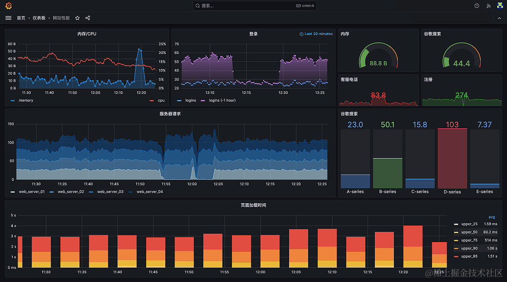

## 简介
Grafana是一个开源的可视化数据探索和监控平台，它可以帮助我们可视化各种数据源，如Prometheus、InfluxDB、Grafana等。Grafana可以用于监控和可视化各种系统，如网络、应用程序、云服务等。在本文中，我们将介绍如何使用Docker部署Grafana。

Grafana的核心功能包括：

- 可视化数据：Grafana可以可视化各种数据源，如Prometheus、InfluxDB、Grafana等。
- 监控系统：Grafana可以用于监控和可视化各种系统，如网络、应用程序、云服务等。
- 数据探索：Grafana可以用于数据探索，帮助我们更好地了解数据。


## 1. Docker部署Grafana
要部署Grafana，我们需要遵循以下具体操作步骤：

详情参考官网：https://grafana.com/

1、安装Docker：首先，我们需要安装Docker。安装过程取决于我们的操作系统。

2、拉取Grafana镜像：我们需要拉取Grafana的镜像。我们可以使用以下命令来拉取Grafana镜像：

```bash

docker pull grafana/grafana
mkdir -p /data/grafana/{data,plugins,config}
chmod -R 777 /data/grafana/data
chmod -R 777 /data/grafana/plugins
chmod -R 777 /data/grafana/config

# 先临时启动一个容器
docker run --name grafana-tmp -d -p 3000:3000 grafana/grafana
# 将容器中默认的配置文件拷贝到宿主机上
docker cp grafana:/etc/grafana/grafana.ini /data/grafana/config/grafana.ini
# 移除临时容器
docker stop grafana-tmp
docker rm grafana-tmp

# 修改配置文件（需要的话）
vim /data/grafana/config/grafana.ini


# 启动 grafana
# 环境变量GF_SECURITY_ADMIN_PASSWORD：指定admin的密码
# 环境变量GF_INSTALL_PLUGINS：指定启动时需要安装得插件
#         grafana-clock-panel代表时间插件
#         grafana-simple-json-datasource代表json数据源插件
#         grafana-piechart-panel代表饼图插件

docker run -d \
    -p 3000:3000 \
    --name=grafana \
    -v /etc/localtime:/etc/localtime:ro \
    -v /data/grafana/data:/var/lib/grafana \
    -v /data/grafana/plugins/:/var/lib/grafana/plugins \
    -v /data/grafana/config/grafana.ini:/etc/grafana/grafana.ini \
    -e "GF_SECURITY_ADMIN_PASSWORD=admin" \
    grafana/grafana:10.2.2

```


## 2、安装TDEngine插件报错
```bash
root@dell:~# docker logs e4be980b813c
Error: ✗ failed to download plugin archive: Get "https://storage.googleapis.com/plugins-community/tdengine-datasource/release/3.5.0/tdengine-datasourread tcp 172.17.0.9:50750->142.251.43.27:443: read: connection reset by peer
```
手动下载插件版本包解压到挂载的目录，/data/grafana/plugins


## 3. 实际应用场景
Grafana可以用于各种实际应用场景，如监控网络、应用程序、云服务等。以下是一些具体的实际应用场景：

- 网络监控：我们可以使用Grafana来监控网络设备，如路由器、交换机、防火墙等。我们可以使用Prometheus来收集网络设备的数据，然后使用Grafana来可视化该数据。
- 应用程序监控：我们可以使用Grafana来监控应用程序的性能，如CPU、内存、磁盘、网络等。我们可以使用Prometheus来收集应用程序的数据，然后使用Grafana来可视化该数据。
- 云服务监控：我们可以使用Grafana来监控云服务，如AWS、Azure、Google Cloud等。我们可以使用Prometheus来收集云服务的数据，然后使用Grafana来可视化该数据。
- IOT物联网设备传感器时序数据的可视化和告警配置等等

## 4. 工具和资源推荐
在部署Grafana时，我们可以使用一些工具和资源来帮助我们。以下是一些推荐：

1、Docker：Docker是一个开源的应用容器引擎，它可以帮助我们将软件应用程序打包成一个可移植的容器，然后运行在任何支持Docker的环境中。我们可以使用Docker来简化Grafana的部署、运行和管理。

2、Docker Compose：Docker Compose是一个开源的工具，它可以帮助我们简化多容器应用程序的部署。我们可以使用Docker Compose来定义和运行多容器应用程序。

3、Prometheus：Prometheus是一个开源的监控和警报系统，它可以帮助我们监控和警报各种数据源，如网络、应用程序、云服务等。我们可以使用Prometheus来收集Grafana的数据。

4、Grafana Labs：Grafana Labs是一个开源的数据可视化和监控平台，它提供了一系列的工具和资源来帮助我们部署和使用Grafana。我们可以访问Grafana Labs的官方网站来获取更多的信息和资源。


